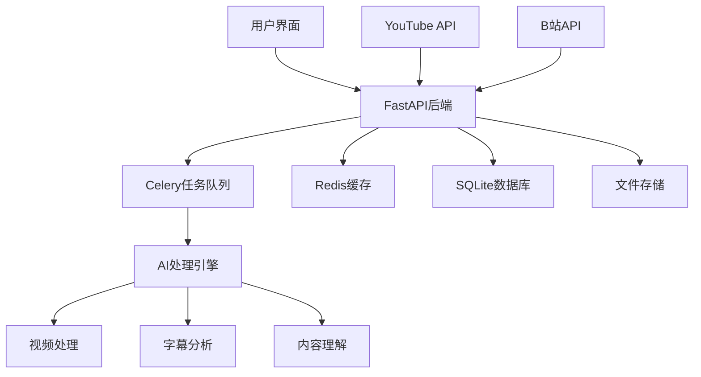

# zhouxiaoka/autoclip

> AutoClip : AI-powered video clipping and highlight generation · 一款智能高光提取与剪辑的二创工具

**Stars**: 5983 ｜ **Forks**: 1184 ｜ **Language**: Python ｜ **最近活跃**: 2026-06-03T12:23:37Z

**用户收藏备注**: AI 智能高光提取与二创剪辑工具，5983★，短视频二创刚需

## README

# AutoClip - AI视频智能切片系统


## 基于AI的智能视频切片处理系统

支持YouTube/B站视频下载、自动切片、智能合集生成

[](https://python.org)
[](https://reactjs.org)
[](https://fastapi.tiangolo.com)
[](https://www.typescriptlang.org)
[](https://celeryproject.org)
[](LICENSE)

[](https://github.com/zhouxiaoka/autoclip)
[](https://github.com/zhouxiaoka/autoclip)
[](https://github.com/zhouxiaoka/autoclip/issues)

**语言**: [English](README-EN.md) | [中文](README.md)  
**联系邮箱**: [christine_zhouye@163.com](mailto:christine_zhouye@163.com)

</div>

## 🎯 项目简介

AutoClip是一个基于AI的智能视频切片处理系统，能够自动从YouTube、B站等平台下载视频，通过AI分析提取精彩片段，并智能生成合集。系统采用现代化的前后端分离架构，提供直观的Web界面和强大的后端处理能力。

**联系方式**: [christine_zhouye@163.com](mailto:christine_zhouye@163.com)

### ✨ 核心特性

- 🎬 **多平台支持**: YouTube、B站视频一键下载，支持本地文件上传
- 🤖 **AI智能分析**: 基于通义千问大语言模型的视频内容理解
- ✂️ **自动切片**: 智能识别精彩片段并自动切割，支持多种视频分类
- 📚 **智能合集**: AI推荐和手动创建视频合集，支持拖拽排序
- 🚀 **实时处理**: 异步任务队列，实时进度反馈，WebSocket通信
- 🎨 **现代界面**: React + TypeScript + Ant Design，响应式设计
- 📱 **移动端支持**【开发中】: 响应式设计，正在完善移动端体验
- 🔐 **账号管理**【开发中】: 支持B站多账号管理，自动健康检查
- 📊 **数据统计**: 完整的项目管理和数据统计功能
- 🛠️ **易于部署**: 一键启动脚本，Docker支持，详细文档
- 📤 **B站上传**【开发中】: 自动上传切片视频到B站
- ✏️ **字幕编辑**【开发中】: 可视化字幕编辑和同步功能

## 🏗️ 系统架构



### 技术栈

#### 后端技术

- **FastAPI**: 现代化Python Web框架，自动API文档生成
- **Celery**: 分布式任务队列，支持异步处理
- **Redis**: 消息代理和缓存，任务状态管理
- **SQLite**: 轻量级数据库，支持升级到PostgreSQL
- **yt-dlp**: YouTube视频下载，支持多种格式
- **通义千问**: AI内容分析，支持多种模型
- **WebSocket**: 实时通信，进度推送
- **Pydantic**: 数据验证和序列化

#### 前端技术

- **React 18**: 用户界面框架，Hooks和函数组件
- **TypeScript**: 类型安全，更好的开发体验
- **Ant Design**: 企业级UI组件库
- **Vite**: 快速构建工具，热重载
- **Zustand**: 轻量级状态管理
- **React Router**: 路由管理
- **Axios**: HTTP客户端
- **React Player**: 视频播放器

## 🚀 快速开始

### 环境要求

#### Docker部署（推荐）

- **Docker**: 20.10+
- **Docker Compose**: 2.0+
- **内存**: 最少 4GB，推荐 8GB+
- **存储**: 最少 10GB 可用空间

#### 本地部署

- **操作系统**: macOS / Linux / Windows (WSL)
- **Python**: 3.8+ (推荐 3.9+)
- **Node.js**: 16+ (推荐 18+)
- **Redis**: 6.0+ (推荐 7.0+)
- **FFmpeg**: 视频处理依赖
- **内存**: 最少 4GB，推荐 8GB+
- **存储**: 最少 10GB 可用空间

### 一键启动

#### 方式一：Docker部署（推荐）

```bash
# 克隆项目
git clone https://github.com/zhouxiaoka/autoclip.git
cd autoclip

# Docker一键启动
./docker-start.sh

# 开发环境启动
./docker-start.sh dev

# 停止服务
./docker-stop.sh

# 检查服务状态
./docker-status.sh
```

#### 方式二：本地部署

```bash
# 克隆项目
git clone https://github.com/zhouxiaoka/autoclip.git
cd autoclip

# 一键启动（推荐，包含完整检查和监控）
./start_autoclip.sh

# 快速启动（开发环境，跳过详细检查）
./quick_start.sh

# 检查系统状态
./status_autoclip.sh

# 停止系统
./stop_autoclip.sh
```

### 手动安装

```bash
# 1. 创建虚拟环境
python3 -m venv venv
source venv/bin/activate  # Linux/macOS
# 或 venv\Scripts\activate  # Windows

# 2. 安装Python依赖
pip install -r requirements.txt

# 3. 安装前端依赖
cd frontend && npm install && cd ..

# 4. 安装Redis
# macOS
brew install redis
brew services start redis

# Ubuntu/Debian
sudo apt update
sudo apt install redis-server
sudo systemctl start redis-server

# CentOS/RHEL
sudo yum install redis
sudo systemctl start redis

# 5. 安装FFmpeg
# macOS
brew install ffmpeg

# Ubuntu/Debian
sudo apt install ffmpeg

# CentOS/RHEL
sudo yum install ffmpeg

# 6. 配置环境变量
cp env.example .env
# 编辑 .env 文件，填入API密钥等配置
```

## 🎬 功能演示

### 主要功能展示

1. **视频下载与处理**
   - 支持YouTube、B站视频链接解析
   - 自动下载视频和字幕文件
   - 支持本地文件上传

2. **AI智能分析**
   - 自动提取视频大纲
   - 智能识别话题时间点
   - 对片段进行精彩度评分

3. **视频切片与合集**
   - 自动生成精彩片段
   - 智能推荐合集组合
   - 支持手动编辑和排序

4. **实时进度监控**
   - WebSocket实时进度推送
   - 详细的任务状态显示
   - 错误处理和重试机制

5. **B站上传功能**【开发中】
   - 自动上传切片视频到B站
   - 支持多账号管理
   - 批量上传和队列管理

6. **字幕编辑功能**【开发中】
   - 可视化字幕编辑器
   - 字幕同步和调整
   - 多语言字幕支持

## 📖 使用指南

### 1. 视频下载

#### YouTube视频

1. 在首页点击"新建项目"
2. 选择"YouTube链接"
3. 粘贴视频URL
4. 选择浏览器Cookie（可选）
5. 点击"开始下载"

#### B站视频

1. 在首页点击"新建项目"
2. 选择"B站链接"
3. 粘贴视频URL
4. 选择登录账号
5. 点击"开始下载"

#### 本地文件

1. 在首页点击"新建项目"
2. 选择"文件上传"
3. 拖拽或选择视频文件
4. 上传字幕文件（可选）
5. 点击"开始处理"

### 2. 智能处理

系统会自动执行以下步骤：

1. **素材准备**: 下载视频和字幕文件
2. **内容分析**: AI提取视频大纲和关键信息
3. **时间线提取**: 识别话题时间区间
4. **精彩评分**: 对每个片段进行AI评分
5. **标题生成**: 为精彩片段生成吸引人标题
6. **合集推荐**: AI推荐视频合集
7. **视频生成**: 生成切片视频和合集视频

### 3. 结果管理

- **查看切片**: 在项目详情页查看所有生成的视频片段
- **编辑信息**: 修改片段标题、描述等信息
- **创建合集**: 手动创建或使用AI推荐的合集
- **下载导出**: 下载单个片段或完整合集
- **B站上传**【开发中】: 一键上传切片视频到B站
- **字幕编辑**【开发中】: 可视化编辑和同步字幕文件

## 🔧 配置说明

### 环境变量配置

创建 `.env` 文件：

```bash
# 数据库配置
DATABASE_URL=sqlite:///./data/autoclip.db

# Redis配置
REDIS_URL=redis://localhost:6379/0

# AI API配置
API_DASHSCOPE_API_KEY=your_dashscope_api_key
API_MODEL_NAME=qwen-plus

# 日志配置
LOG_LEVEL=INFO
ENVIRONMENT=development
DEBUG=true

# 文件存储
UPLOAD_DIR=./data/uploads
PROJECT_DIR=./data/projects
```

### B站账号配置【开发中】

1. 在设置页面点击"B站账号管理"
2. 选择登录方式：
   - **Cookie导入**（推荐）：从浏览器导出Cookie
   - **账号密码**：直接输入账号密码
   - **二维码登录**：扫描二维码登录
3. 添加成功后系统会自动管理账号健康状态

## 📁 项目结构

```text
autoclip/
├── backend/                 # 后端代码
│   ├── api/                # API路由
│   │   ├── v1/            # API v1版本
│   │   │   ├── youtube.py # YouTube下载API
│   │   │   ├── bilibili.py # B站下载API
│   │   │   ├── projects.py # 项目管理API
│   │   │   ├── clips.py   # 视频片段API
│   │   │   ├── collections.py # 合集管理API
│   │   │   └── settings.py # 系统设置API
│   │   └── upload_queue.py # 上传队列管理
│   ├── core/              # 核心配置
│   │   ├── database.py    # 数据库配置
│   │   ├── celery_app.py  # Celery配置
│   │   ├── config.py      # 系统配置
│   │   └── llm_manager.py # AI模型管理
│   ├── models/            # 数据模型
│   │   ├── project.py     # 项目模型
│   │   ├── clip.py        # 片段模型
│   │   ├── collection.py  # 合集模型
│   │   └── bilibili.py    # B站账号模型
│   ├── services/          # 业务逻辑
│   │   ├── video_service.py # 视频处理服务
│   │   ├── ai_service.py  # AI分析服务
│   │   └── upload_service.py # 上传服务
│   ├── tasks/             # Celery任务
│   │   ├── processing.py  # 处理任务
│   │   ├── upload.py      # 上传任务
│   │   └── maintenance.py # 维护任务
│   ├── pipeline/          # 处理流水线
│   │   ├── step1_outline.py # 大纲提取
│   │   ├── step2_timeline.py # 时间线分析
│   │   ├── step3_scoring.py # 精彩度评分
│   │   └── step6_video.py # 视频生成
│   └── utils/             # 工具函数
├── frontend/              # 前端代码
│   ├── src/
│   │   ├── components/    # React组件
│   │   │   ├── UploadModal.tsx # 上传模态框
│   │   │   ├── ClipCard.tsx # 片段卡片
│   │   │   ├── CollectionCard.tsx # 合集卡片
│   │   │   └── BilibiliManager.tsx # B站管理
│   │   ├── pages/         # 页面组件
│   │   │   ├── HomePage.tsx # 首页
│   │   │   ├── ProjectDetailPage.tsx # 项目详情
│   │   │   └── SettingsPage.tsx # 设置页面
│   │   ├── services/      # API服务
│   │   │   └── api.ts     # API客户端
│   │   └── stores/        # 状态管理
│   └── package.json
├── data/                  # 数据存储
│   ├── projects/          # 项目数据
│   ├── uploads/           # 上传文件
│   ├── temp/              # 临时文件
│   ├── output/            # 输出文件
│   └── autoclip.db        # 数据库文件
├── scripts/               # 工具脚本
│   ├── start_autoclip.sh  # 启动脚本
│   ├── stop_autoclip.sh   # 停止脚本
│   └── status_autoclip.sh # 状态检查
├── docs/                  # 文档
│   ├── README.md          # 文档中心
│   ├── i18n.md           # 国际化配置
│   └── *.md              # 其他文档
├── logs/                  # 日志文件
├── Dockerfile             # Docker镜像构建文件
├── Dockerfile.dev         # 开发环境Docker文件
├── docker-compose.yml     # 生产环境Docker编排
├── docker-compose.dev.yml # 开发环境Docker编排
├── docker-start.sh        # Docker启动脚本
├── docker-stop.sh         # Docker停止脚本
├── docker-status.sh       # Docker状态检查脚本
├── .dockerignore          # Docker忽略文件
├── DOCKER.md              # Docker部署文档
└── *.sh                   # 启动脚本
```

## 🌐 API文档

启动系统后访问以下地址查看API文档：

- **Swagger UI**: [http://localhost:8000/docs](http://localhost:8000/docs) (本地开发环境)
- **ReDoc**: [http://localhost:8000/redoc](http://localhost:8000/redoc) (本地开发环境)

### 主要API端点

| 端点 | 方法 | 描述 |
|------|------|------|
| `/api/v1/projects` | GET | 获取项目列表 |
| `/api/v1/projects` | POST | 创建新项目 |
| `/api/v1/projects/{id}` | GET | 获取项目详情 |
| `/api/v1/youtube/parse` | POST | 解析YouTube视频信息 |
| `/api/v1/youtube/download` | POST | 下载YouTube视频 |
| `/api/v1/bilibili/download` | POST | 下载B站视频 |
| `/api/v1/projects/{id}/process` | POST | 开始处理项目 |
| `/api/v1/pro
